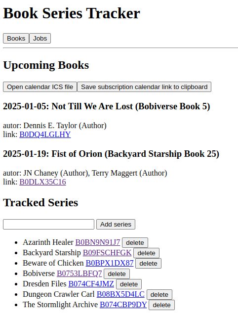

# book-series-tracker

I recently started reading few long book series, getting my money’s worth on the Kindle Unlimited subscription. With most series still running, I needed some solution to track upcoming books without having to manually check and track release dates. This is how this ugly baby was born.

The server, while running, will scrape Amazon pages for all configured series once per day, looking for any newly announced books. Basic web app allows for browsing upcoming books/tracked series without auth, but to add new series, or trigger any writes user must be logged in. Users can be added from command line.

I am trying to open my heart to Rust, so that’s what the server is written in. Used Rocket for www server, while web UI is TypeScript + React. I run it on home server, with https-terminating proxy in front (cause passwords).

Couple external deps:
- sqlite3 - database
- geckodriver - selenium web scraper

This is how UI looks like:



## Cheatsheet

Unless otherwise noted, all commands in project root dir.

Set up database
```
$ sqlite3 db/bst.db < db/init.sql
```

Run webdriver (for scraping) and server itself:
```
$ geckodriver &
$ ROCKET_LOG_LEVEL=normal ROCKET_ADDRESS=0.0.0.0 cargo run server
```

Add new user or change password of existing user:
```
$ cargo run passwords
```

Synchronize the backend Rust types with TypeScript types used in UI:
```
$ cargo run genjs
```

Compile  {Type,Java}Script into bundle file (run from `./js` dir):
```
$ npm install && npm run build
```
## Attributions

Icons/glyphs from https://tabler.io/icons
